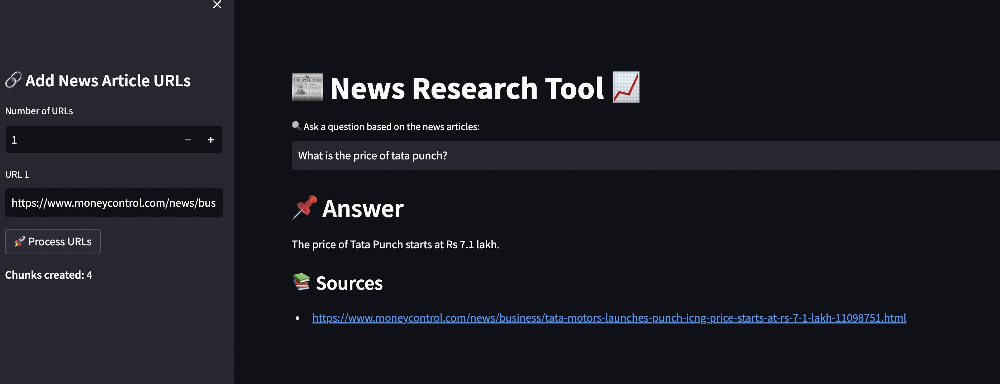

# News Research Tool

This chatbot is a user-friendly news research tool designed for effortless information retrieval. Users can input article URLs and ask questions to receive relevant insights from the stock market and financial domain.



---

## Features

- Load URLs directly or upload text files containing URLs to fetch article content.
- Process article content using LangChain's UnstructuredURL Loader.
- Generate embedding vectors using OpenAI's embeddings.
- Utilize FAISS, a powerful similarity search library, for fast and effective retrieval of relevant information.
- Interact with LLMs (ChatGPT) by inputting queries and receiving answers along with source URLs.

---

## Installation

1. **Clone this repository to your local machine:**

    ```bash
    git clone https://github.com/hedayush97/LLM-News-Reader
    ```

2. **Navigate to the project directory:**

    ```bash
    cd 2_news_research_tool_project
    ```

3. **Install the required dependencies:**

    ```bash
    pip install -r requirements.txt
    ```

4. **Set up your OpenAI API key:**

    Create a `.env` file in the project root and add your API key:

    ```bash
    OPENAI_API_KEY=your_api_key_here
    ```

---

## Usage

1. **Run the Streamlit app:**

    ```bash
    streamlit run main.py
    ```

2. **Using the web app:**

- On the sidebar, input article URLs directly (or upload a text file containing URLs).
- Click **"Process URLs"** to load and process the articles.
- The app will:
  - Fetch and extract article text.
  - Perform text splitting.
  - Generate embedding vectors.
  - Efficiently index the content using FAISS.
- The FAISS index will be saved locally in a pickle file for future use.
- Ask questions based on the processed news articles and receive answers sourced directly from them.

---

## Sample News Articles Tested

Here are some example URLs used during development and testing:

- [Tata Motors, Mahindra gain certificates for production linked payouts](https://www.moneycontrol.com/news/business/tata-motors-mahindra-gain-certificates-for-production-linked-payouts-11281691.html)
- [Tata Motors launches Punch ICNG, price starts at Rs 7.1 lakh](https://www.moneycontrol.com/news/business/tata-motors-launches-punch-icng-price-starts-at-rs-7-1-lakh-11098751.html)
- [Buy Tata Motors, target of Rs 743 – KR Choksey](https://www.moneycontrol.com/news/business/stocks/buy-tata-motors-target-of-rs-743-kr-choksey-11080811.html)

---

## Project Structure

- **main.py** — Main Streamlit application script.
- **requirements.txt** — List of required Python packages.
- **faiss_store_openai.pkl** — Pickle file storing the FAISS index.
- **.env** — Environment variables file containing the OpenAI API key.

---
